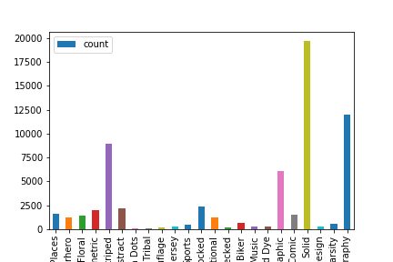

# Image Classification: Graphic type T-shirts classifier
## The problem  
This project aims at creating a model that identifies the 'graphic type' of t-shirts with the t-shirt image as an input and the graphic type of the t-shirt as the output.  
Ecommerce will utilize this model to Catalogue products. And as a fashion forecasting tool, to ascertain which graphic t-shirt type sells more and hence needs to be produced or kept in stock, and help customers search and filter for different types of t-shirts with the graphic type present as an attribute.  
Data inputs  
-- Image patch to download/view it, Graphic type.  
-- Training data has ~70,000 rows of data.

## Requirements
* Python 3.6
* Keras = 2.x (Tensorflow backend)
* Pickle


## Code
The code contains the following files.

1. __process_data.py__: used to download, clean and split all images data.
2. __classifier.py__: used to train 3 CNN models to classify images: *vgg16*, *resnet50* and *inceptionv3* with modified top layers.
3. __ensemble_model.py__: create an ensemble model from 3 pre-trained models above to predict the last result.
4.  __create_submission.py__: to fill the result into submission file, using prediction from ensemble model.

## Model

This use an ensemble model which was stacked from 3 models (vgg16, resnet50 and inceptionv3 with modified top layers). The structure is descibed as following.


## Usage

### Prepare the image data sets
The images data includes 68870 valid data (not null), after downloaded and clearned, it remains 68771 valid images belong to 24 classes. The distribution of training set is shown as follow:

<p align = "center">

</p>

The training set is highly imbalance, and the class "Horizontal Stripes" is empty. So I drop this class from the training set and split the data to training set and test set with ratio 0.1: 61884 training images, 6880 validation images.

Due to my model input, all images are resized into 264x198 pixels and stored to folder name `264x198` and `264x198-val` as train set and test set. The images are stored as the following structure:
```
./data/
	264x198/
		People and Places/
		      1.jpg
		      2.jpg
		      ...
	    Superhero/
		      3.jpg
		      4.jpg
		      ...
	    Floral/
		      5.jpg
		      6.jpg
		      ...
	    ...
	264x198-val/
	    People and Places/
		      1-val.jpg
		      2-val.jpg
		      ...
	    Superhero/
		      3-val.jpg
		      4-val.jpg
		      ...
	    Floral/
		      5-val.jpg
		      6-val.jpg
		      ...
	    ...
```
Running code:
```sh
$ python process_data.py
```
The script will read image urls from the file `myntra_train_dataset.csv` , then download all images and save into folder `data/train/`, clean them. After downloaded all the images, the script will continue running to split images into folders `264x198` and `264x198-val`. 

The script also read the file `myntra_test.csv` and download all the test images and save into the folder `data/test/`.

### Training
#### Pre-trained
All three child models have already been trained and their best weights are saved into the main directory as names: `vgg16_weights.h5`, `resnet50_weights.h5`, `inceptionv3_weights.h5`. 

The ensemble model (the last model) is also build from three pre-trained models above and saved into file `ensemble_final.h5` (full model), due to large file, you can download from [here]() or run the following code to create your own:
```sh
$ python ensemble_model.py
```
Due to lack of time, I only train each model with 30 epochs. So if you have time, you can train each model with 100 epochs for example, maybe you can push up the accuracy.

#### Training new one
If you do not wish to re-train the models feel free to skip this step and go straight into classifying the test set. Otherwise, you can training the model by running the command:
```sh
$ python classifier.py
```
By default setting, the classifier will train all 3 child models with 10 epochs each model. So if you want to train more epochs, you will need to modify the script or run the script many times. After training done, the script will save the weights into files:`vgg16_weights.h5`, `resnet50_weights.h5`, `inceptionv3_weights.h5`.

### Classifying

Run command:
```sh
$ python ensemble_model.py
```
The script will construct an stacked model by averaging the outputs from 3 child models above to make the final prediction. The stacked model will make prediction of the test set and save into files:
* `ensemble_result.pkl`: a dictionary contains file names, label map, prediction labels.
* `ensemble_final.h5`: the stacked model file, we will using it to convert model into `.pb` format.

### Make submission file

Run command:
```sh
$ python submission.py
```
The script will read the file `ensemble_result.pkl` and fill the predicted class into the submission form.

### Convert into tensorflow format (.pb)
Run command:
```sh
$ python keras_to_tensorflow.py -input_model_file ensemble_final.h5
```
The script will convert model into tensorflow graph format file and save as name `ensemble_final.pb`.

## Results:

All three child models only got 74~75% accuracy on the validation set. Using ensemble technique, the final model got 77% accuracy.


